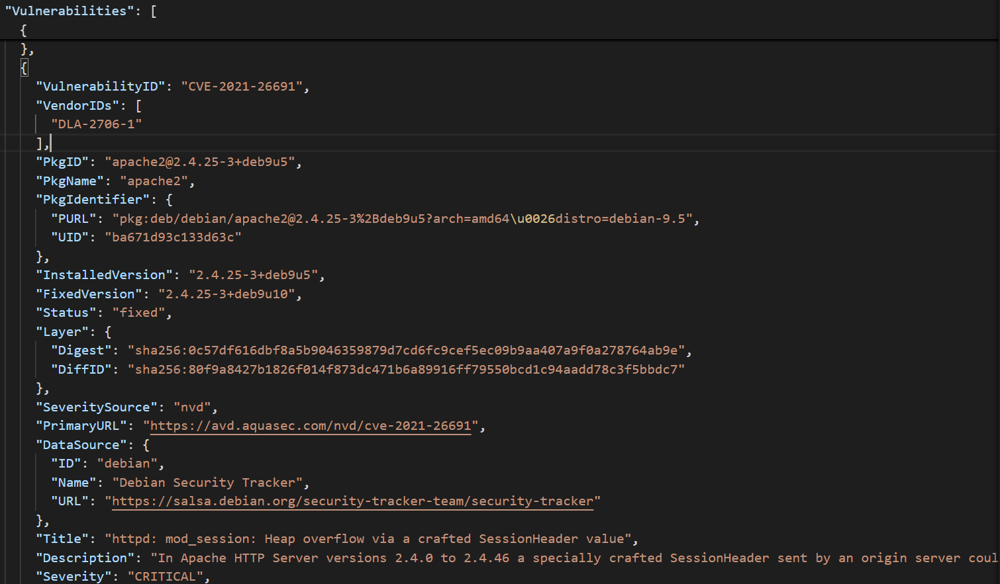
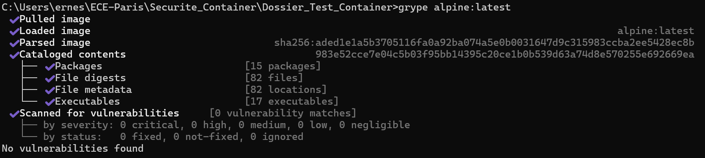

# Introduction aux Contenaires et à la Sécurité 

## Enjeux de Sécurité des Containers : Activités Pratiques

### 1. Lancer un Container simple : 

Voici ce qu'il se produit une fois que l'on a exécuté la commande suivante : 

```bash
  docker run --rm hello-world
```

Dans un premier temps, nous recevons un message d'erreur indiquant qu'aucune image 'hello-world:latest' n'a été trouvée localement. Docker va donc en récupérer une depuis le Docker Hub. Cette image sera ensuite stockée localement sur notre machine. Une fois téléchargée, un conteneur sera créé et exécuté à partir de cette image, affichant le message suivant : **Hello from Docker!**


### 2. Explorer un Container en Interactif : 

On lance un container intéractif basé sur **Alpine**.

```bash
docker run -it --rm alpine sh
```

On accède à un terminal directement dans le container. **Alpine** étant un environnement **Linux** il nous est possible d'exécuter des commandes Linux tel que **ls** ; **pwd** et **whoami**. Celles-ci nous permettent respectivement de : 

- Lister les fichiers et répertoires dans un répertoire donné.

- Affiche le chemin absolu du répertoire dans lequel on se trouve.

- Affiche le nom de l'utilisateur actuellement connecté au terminal (root dans notre cas).

### 3. Analyser les ressources système d'un container : 

Dans cette étape, on cherche à surveiller les ressources utilisées par un container. 
Les deux commandes suivantes permettent le lancement d'un container **nginx** et de surveiller la consommation des ressources du container : 

```bash
docker run -d --name test-container nginx
docker stats test-container
```

En sortie on obtient les statistiques d'utilisation des ressources de notre container. Notamment la consommation du cpu et de la mémoire. 

- La consommation du **CPU** est de **0,00%**.

- L'utilisation de la **mémoire** est de **14,95MB**. 

### 4. Lister les capacités d'un container : 

La commande suivante va permettre de lister les capacités du container **Alpine Linux** : 

```bash
docker run --rm --cap-add=SYS_ADMIN alpine sh -c "cat /proc/self/status"
```
On va faire afficher dans notre terminal le contenu du fichier **/proc/self/status**. 

- **`Name: cat`** → Le nom du processus exécuté **(cat)**.
- **`Uid:    0       0       0       0`** et **`Gid:    0       0       0       0`** → indiquent que le processus s'exécute en tant que **root** dans notre container.
- **`Seccomp: 2`** → signifie que le container utilise un mode de **filtrage strict**.
- **`NoNewPrivs: 0`** → **0** signifie que les processus lancés peuvent obtenir de **nouveaux privilèges**.


## Vulnérabilités et Menaces : Activités Pratiques

### 1. Tester un Container avec des Permissions Elevées : 

La commande suivante permet de lancer, avec Docker, un container avec des privilèges élevés : 

```bash
docker run --rm --privileged alpine sh -c 'echo hello from privileged mode'
```

La commande a fonctionné et a correctement affiché **"Hello from privileged mode"**. Cependant, cette pratique est dangereuse car le conteneur obtient les mêmes droits qu'un utilisateur **root** sur notre machine. Cela lui permettrait d'effectuer des modifications potentiellement dangereuses sur le système, **augmentant ainsi les risques**.

### 2. Simuler une évasion  de Container : 

On lance un container dans lequel on a monté le système de fichiers de l'hôte, c'est à dire rendre le rendre accessible directement depuis le container. Le container peut donc directement voir et manipuler les fichiers du système principal.

```bash
docker run --rm -v /:/mnt alpine sh -c 'ls /mnt'
```

Cette faille de sécurité est très dangereuse. Elle donne un accès total aux fichiers du système hôte. Le container peut **lire, modifier ou supprimer** n'importe quel fichier du système hôte. Cela mène à une évasion complète du container.

### 3. Créer une Image Sécurisée : 

On crée fichier **Dockerfile** avec le contenu suivant : 

```bash
FROM alpine
RUN adduser -D appuser
USER appuser
CMD ["echo", "Container sécurisé!"]
```
La commande suivante permet de **construire** l'image basé sur Alpine Linux, avec un nouvel utilisateur `appuser` et une commande par défaut qui affiche `Container sécurisé!` : 

```bash
docker build -t secure-container .
```
Une fois l'image construite on va lancer le container pour voir le message de confirmation (`Container sécurisé!`) : 

```bash
docker run --rm secure-container
```
Pour voir l’ID utilisateur et l’UID de appuser, on exécute cette commande : 

```bash
docker run --rm secure-container id
```

La création d'un utilisateur nous permet d'éviter d'exécuter le container en tant que **root**. On passe en mode `appuser`, donc toutes les commandes dans le container seront exécutées avec ce compte. 

### 4. Restreindre l'accès réseau d'un container : 

On commence par lancer un container en arrière plan : 

```bash
docker run -d --name mon-container alpine sleep 1000
```
Ce container reste actif pendant 1000 secondes. 

On test si ce container a accès à internet : 

```bash
docker exec mon-container ping -c 4 google.com
```
Notre container a bien accès à internet car il ping bien le serveur **Google**.

### 5. BLoquer la connexion internet dans un container : 

La commande suivante permet de restreindre l'accès internet à `mon-container` en déconnectant le container du réseau **bridge** : 

```bash
docker network disconnect bridge mon-container
```

### 6. Tester l'accès internet avec par exemple `ping google.com` : 

Nous essayons de ping le **serveur google** avec notre container : 

```bash
docker exec mon-container ping -c 4 google.com
```
En répons on obtient `ping: bad address 'google.com'`. Notre container n'a donc pas réussi à communiquer avec `google.com`. Il n'a donc plus d'accès **internet**. 
Cette précaution est utile pour limiter l'exposition d'un service qui n'a pas besoin d'internet. Cela renforce la sécurité en empéchant à un container de communiquer avec l'extérieur. 

### 7. Télécharger et Scanner une Image : 

On télécharge une image **vulnérable** pour l'analyser avec `Trivy`. 

```bash
docker pull vulnerables/web-dvw
trivy image vulnerables/web-dvwa
```

Le résultat de l'analyse est écrit dans un fichier json enregistré directement dans le repertoire dans lequel on se trouve. 

```bash
trivy image -f json -o resultat_trivy.json vulnerables/web-dvwa
```
L'image ci-dessous montre une faille de sécurité trouvée par Trivy et classée comme étant **CRITITQUE**. Trivy indique le paquet concerné ainsi qu'une déscription de la faille.



D'après **Trivy** il y aurait **1574** failles détectées. Chaque vulnérabilité détectée est décrite par un **identifiant unique** (CVE), les versions du **paquet affecté**, le statut de correction, et des informations sur la gravité et la source de sécurité.

- `Fixed` : La vulnérabilité a été corrigée dans une version plus récente du package.

- `will_not_fix` : Le fournisseur a décidé de ne pas corriger la vulnérabilité.

- `affected` : Le package est vulnérable, mais aucune mise à jour corrective n’est encore disponible.

### 8. Scanner une Image pour Détecter les Vulnérabilités : 

On analyse une image avec **Grype**.

```bash
grype alpine:latest
```


Les deux outils fonctionnent de manière similaire mais avec des nuances dans la manière dont ils abordent la sécurité des images. Trivy peut offrir des informations plus détaillées sur les dépendances, tandis que Grype peut être plus focalisé sur des vulnérabilités dans les paquets installés.

## Etude de Cas : Attaque par Elévation de privilège : 

Pour éviter d'être confronté à un tel problème voici quelques mesures à mettre en place : 

-   **Empêcher l'exécution d'un container avec `root`** :  

      Comme nous l'avons vu précédemment, il est possible à l'aide d'un **Dockerfile** de restreindre l'exécution des containers. Il faut spécifier un utilisateur non privilégié dans le dockerfile, ce qui empêche le container de s'exécuter en tant que `root` par défaut.
      ```bash
      FROM alpine
      RUN adduser -D appuser
      USER appuser
      ```

- **Isolation du système de fichiers** : 

    Les fichiers sensibles comme les sauvegardes de base de données ne doivent pas être montés directement dans le container. Les fichiers critiques de l'hôte doivent être **isolés** des containers.

- **Limitation de l'accès au réseau** : 

    Sécuriser le réseau du container : Restreindre l’accès réseau d’un container afin qu’il ne puisse pas communiquer librement avec l’extérieur ou l’hôte si cela est possible.

- **L'utilisation d'outils comme `Trivy` ou `Grype`** : 

    Ces outils permettent d'identifier et de corriger de potentiels vulnérabilités dans l'image du container avant le déploiement de celui-ci. Un scan régulier de ces images pourrait prévenir  l'exécution de containers mal configurés avec des permissions excessives ou des vulnérabilités non corrigées, réduisant ainsi le risque d'élévation de privilèges.