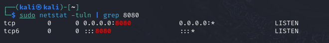
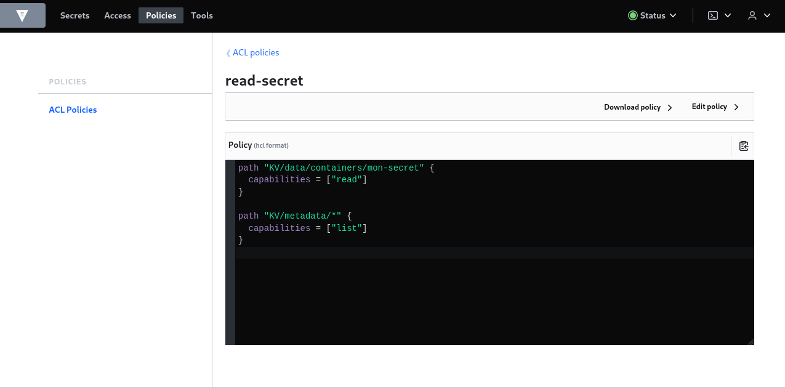
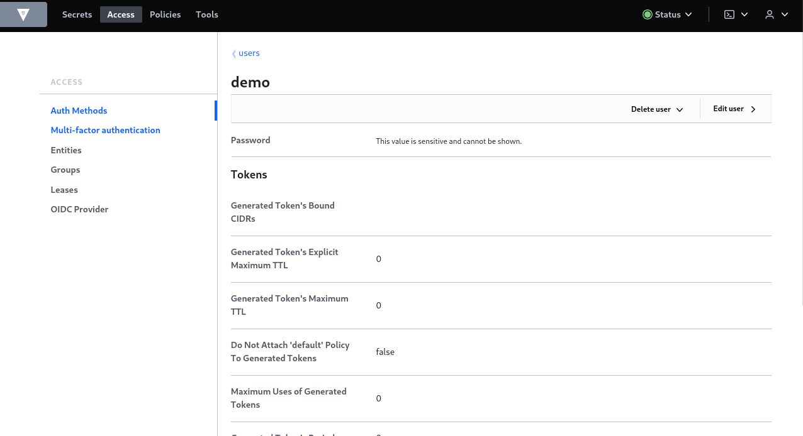
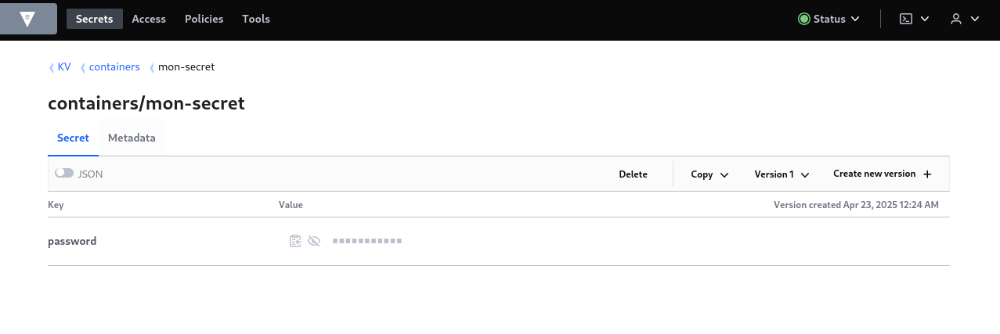

# Bonnes Pratiques de Sécurité 

### 1. Éviter l’Exposition Involontaire de Ports 

On lance le container avec restriction de ports en utilisant la commande suivante :

```bash
docker run -d -p 8080:80 nginx
```

On utilise **`netsat`** pour verifier si les ports sont exposés.
```bash
sudo netstat -tuln | grep 8080
```
On obtient :



Le service écoute bien sur le port 8080 en IPv4 et IPv6, ce qui signifie que l’application est exposée en réseau.

### 2. Restreindre les permissions d’accès aux fichiers sensibles

On commence par monter un volume avec des permissions spécifiques :
```bash
docker run -it --rm -v /etc/passwd:/mnt/passwd:ro alpine sh
```

On effectue ensuite des tests de permissions :

- Pouvons-nous lire le fichier `/mnt/passwd` ? 
```bash
cat /mnt/passwd
```

- Pouvons-nous écrire dans le fichier `/mnt/passwd` ?
```bash
echo "Hello" >> /mnt/passwd
```

Le fichier est en **read-only** **`(:ro)`**, le fichier pourra être lu sans problèmes, mais toutes tentatives de modifications renverra une erreur de type **`Permission denied`**

### 3. Auditer la configuration d’un container avec Docker Bench
On installe et exécute Docker Bench for Security
```bash
git clone https://github.com/docker/docker-bench-security.git
cd docker-bench-security/
```
On lance le test d'audit 
```bash
docker run -it --name docker-bench `
>> -v //var/run/docker.sock:/var/run/docker.sock `
>> -v ${PWD}:/usr/local/bin/docker-bench-security `
>> docker/docker-bench-security
```
Résultat du scan :

- Nombre total de contrôles : 74
- Score obtenu : 6
- Plusieurs avertissements ``WARN`` ont été détectés, indiquant des pratiques de configuration à améliorer.

On passe ensuite à l'audit du container ``vulnerables/web-dvwa``
```bash
trivy image vulnerables/web-dvwa
```

Ce scan a révélé **de très nombreuses failles** dans les bibliothèques installées :

-  Plusieurs **dizaines de CVE critiques, hautes et moyennes**
- Exemples :
  - `CVE-2019-11042` : PHP – buffer over-read
  - `CVE-2021-21703` : PHP-FPM – élévation de privilèges
  - Clé privée détectée : `/etc/ssl/private/ssl-cert-snakeoil.key`


### 4. Stocker et Utiliser des Secrets 
On commence par lancer le container vault avec la commande suivant :
```bash
docker run --cap-add=IPC_LOCK -e 'VAULT_LOCAL_CONFIG={"storage": {"file": {"path": "/vault/file"}}, "listener": [{"tcp": { "address": "0.0.0.0:8200", "tls_disable": true}}], "default_lease_ttl": "168h", "max_lease_ttl": "720h", "ui": true}' -p 8200:8200 vault:1.13.3 server
```
On se connecte ensuite à l'interface Vault à l'aide des clés fournies et du token root.

On crée :
- Une ACL au chemin containers/mon-secret pour lire un secret


- Un user


- Un secret.



On lance un container alpine avec la commande 
```bash
 docker run -it alpine /bin/sh
```
Puis on lance la commande d'auth
```bash
curl -s --request POST \
  --data '{"password": "pass123"}' \
  http://10.0.2.15:8200/v1/auth/userpass/login/demo
```
Cela va nous donner un token que l'on utilisera dans la commande suivant pour retrouver notre secret
```bash
curl -s \
  --header "X-Vault-Token: <token>" \
  http://10.0.2.15:8200/v1/KV/data/containers/mon-secret | jq
```

### 5. Trouver la clé


Comment le développeur aurait dû faire pour éviter ceci ?
- Ne jamais inclure de secrets dans le Dockerfile
- Utiliser des variables d’environnement au moment de l’exécution
- Utiliser un gestionnaire de secrets
- Ajouter un ``.dockerignore``
- Vérifier l’image avec des outils d’analyse