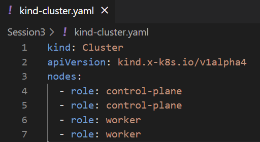
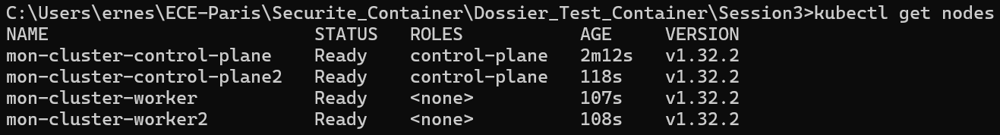

 
# Sécurité des orchestrateurs

## Activités Pratiques

### 1. Déployer un Cluster Kubernetes avec Kind : 

On commence par créer un fichier `yaml` qui définit un **cluster** avec 2 master nodes et 2 worker nodes.



Dans un second temps on va venir créer notre **cluster Kubernetes** selon notre configuration avec la commande suivante : 

```bash
kind create cluster --config kind-cluster.yaml --name mon-cluster
```

Une fois le cluster déployé, on va vérifier son état : 



Notre cluster a été créé avec succès, comme prévu, avec **2 master nodes** et **2 worker nodes**. Tous les nœuds sont à l'état `Ready`, ce qui signifie qu'ils sont prêts à exécuter des pods et à participer au fonctionnement du cluster.