 
# Sécurité des orchestrateurs

## Activités Pratiques

### 1. Déployer un Cluster Kubernetes avec Kind : 

On commence par créer un fichier `yaml` qui définit un **cluster** avec 2 master nodes et 2 worker nodes.


Dans un second temps on va venir créer notre **cluster Kubernetes** selon notre configuration avec la commande suivante : 

```bash
kind create cluster --config kind-cluster.yaml --name mon-cluster
```

Une fois le cluster déployé, on va vérifier son état : 


Notre cluster a été créé avec succès, comme prévu, avec **2 master nodes** et **2 worker nodes**. Tous les nœuds sont à l'état `Ready`, ce qui signifie qu'ils sont prêts à exécuter des pods et à participer au fonctionnement du cluster.

Pour afficher les namespaces dans un cluster Kubernetes, il faut utiliser la commande suivante :  

```bash
kubectl get namespaces
```

Cette commande permet de lister tous les namespaces actifs dans le cluste, ainsi que leur statut et leur âge.

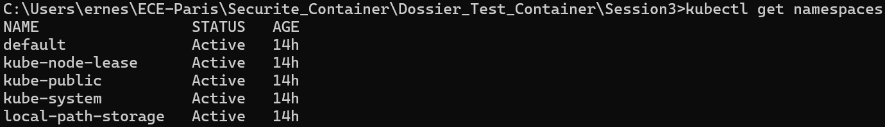

Pour vérifier la version **kubernetes** déployé il faut utiliser la commande suivante : 

```bash
kubectl version
```

Dans notre cas on utilise la version client est **1.32.2**.
La version de Kubernetes qui tourne sur notre cluster est aussi **1.32.2** ce qui signifie que notre client et notre serveur sont bien compatibles.

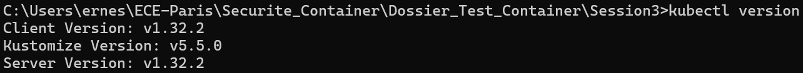


### 2. Expérimentation des RBAC : 

On commence par créer un namespace `test-rbac` : 

```bash
kubectl create ns test-rbac
```

On crée un fichier `mon-pod.yalm` avec le contenu suivant : 

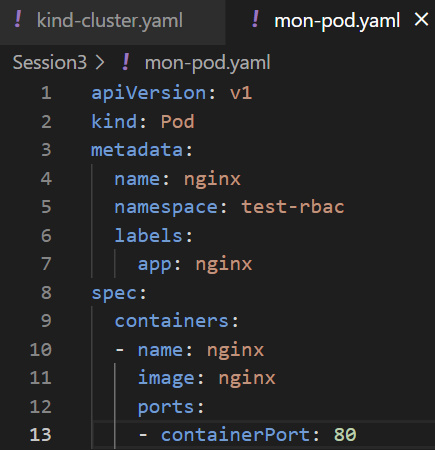

On déploie ce pod dans notre namespace : `test-rbac` avec la commande suivante : 

```bash
kubectl apply -f mon-pod.yaml
```

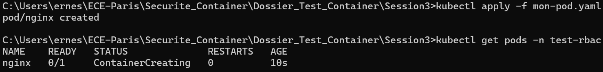

Notre **pod** a bien été créé.

Pour afficher les logs de notre pod il faut utiliser la commande suivante : 

```bash
kubectl logs nginx -n test-rbac
```


Création d'un fichier `role-pod-reader.yaml` afin d'avoir un **rôle** capable de lire les pods dans le namespace `test-rbac`. 

On applique le rôle avec la commande suivante : 

```bash
kubectl apply -f role-pod-reader.yaml
```

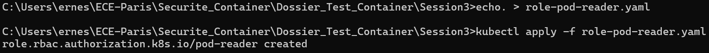

Notre rôle est bien créée et maintenant nous voulons l'afficher : 

```bash
kubectl get roles -n test-rbac
```
Cette commande permet d'afficher le rôle avec son nom et la date et l'heure à laquelle il a été créé.

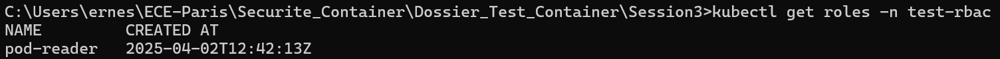

Maintenant on va venir lier ce rôle à un utilisateur **fictif**, `titi` dans notre cas. 

On commence par créer un fichier YAML (rolebinding-pod-reader.yaml) qui nous permet **d'accorder les permissions définies** dans le rôle `pod-reader` à l'utilisateur `titi` : 


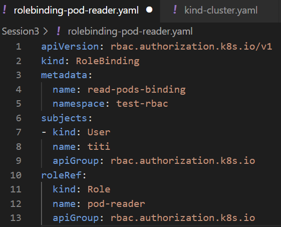

On applique le fichier et on s'assure que `RoleBinding` a bien été créé : 

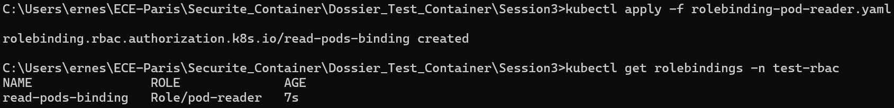

Création de notre utilisateur ficitf **titi** : 

On commence par copier les **certificats CA** depuis le container `mon-cluster-control-plane` : 

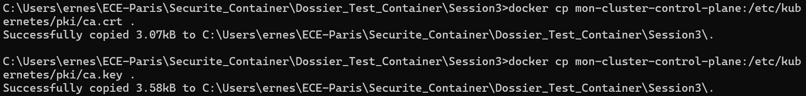

Génération des **clés** et **certificat** pour notre utilisateur `titi` : 

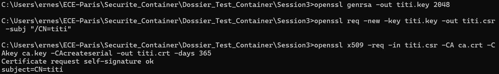

On ajoute l'utilisateur `titi` dans le contexte kubeconfig : 

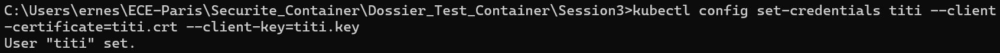 

```bash
kubectl config set-credentials titi --client-certificate=titi.crt --client-key=titi.key
```
Cela va permettre à l'utilisateur `titi` de s'authentifier avec son certificat et sa clé privé pour **intéragir** avec le cluster.

La commande suivante permet de créer un **nouveau contexte Kubernetes** appelé `titi-context` dans notre fichier de configuration kubeconfig. Le contexte spécifie les informations nécessaires pour interagir avec un **cluster Kubernetes**

On bascule de contexte : 

```bash
kubectl config use-context titi-context
```

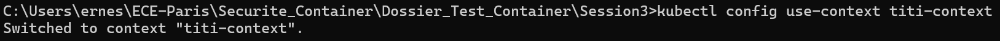

#### Tester l'accès en tant que titi : 

-Lister les pods : 

```bash
kubectl get pods
```
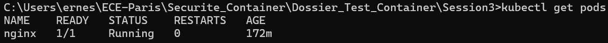

Cela fonctionne car on a lié le rôle `pod-reader` à l'utilisateur `titi`, ce qui lui donne la permission de lister les **pods** dans le namespace `test-rbac`.

-Créer un pod : 

On va tester de créer un pod avec l'utilisateur `titi`. 

On commence par créer un **fichier YALM pour un nouveau pod** : `nouveau-pod.yaml`

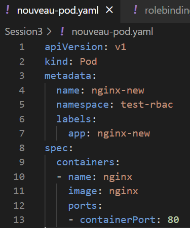

Maintenant on tente de créer le **pod** avec l'utilisateur `titi` : 

```bash
kubectl apply -f nouveau-pod.yaml
```

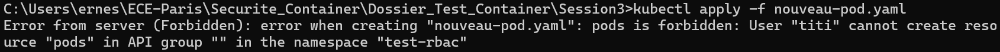

On obtient une erreur nous indiquant que l'utilisateur `titi` ne peut pas créer de pod. C'est tout à fait normal car il ne possède qu'un rôle `pod-reader` qui ne lui donne que les permissions de lecture et non de création.