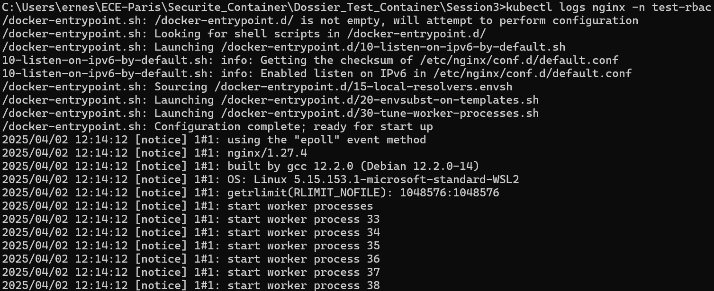

 
# Sécurité des orchestrateurs

## Activités Pratiques

### 1. Déployer un Cluster Kubernetes avec Kind : 

On commence par créer un fichier `yaml` qui définit un **cluster** avec 2 master nodes et 2 worker nodes.


Dans un second temps on va venir créer notre **cluster Kubernetes** selon notre configuration avec la commande suivante : 

```bash
kind create cluster --config kind-cluster.yaml --name mon-cluster
```

Une fois le cluster déployé, on va vérifier son état : 


Notre cluster a été créé avec succès, comme prévu, avec **2 master nodes** et **2 worker nodes**. Tous les nœuds sont à l'état `Ready`, ce qui signifie qu'ils sont prêts à exécuter des pods et à participer au fonctionnement du cluster.

Pour afficher les namespaces dans un cluster Kubernetes, il faut utiliser la commande suivante :  

```bash
kubectl get namespaces
```

Cette commande permet de lister tous les namespaces actifs dans le cluste, ainsi que leur statut et leur âge.


Pour vérifier la version **kubernetes** déployé il faut utiliser la commande suivante : 

```bash
kubectl version
```

Dans notre cas on utilise la version client est **1.32.2**.
La version de Kubernetes qui tourne sur notre cluster est aussi **1.32.2** ce qui signifie que notre client et notre serveur sont bien compatibles.


### 2. Expérimentation des RBAC : 

On commence par créer un namespace `test-rbac` : 

```bash
kubectl create ns test-rbac
```

On crée un fichier `mon-pod.yalm` avec le contenu suivant : 


On déploie ce pod dans notre namespace : `test-rbac` avec la commande suivante : 

```bash
kubectl apply -f mon-pod.yaml
```


Notre **pod** a bien été créé.

Pour afficher les logs de notre pod il faut utiliser la commande suivante : 

```bash
kubectl logs nginx -n test-rbac
```



Création d'un fichier `role-pod-reader.yaml` afin d'avoir un **rôle** capable de lire les pods dans le namespace `test-rbac`. 

On applique le rôle avec la commande suivante : 

```bash
kubectl apply -f role-pod-reader.yaml
```


Notre rôle est bien créée et maintenant nous voulons l'afficher : 

```bash
kubectl get roles -n test-rbac
```
Cette commande permet d'afficher le rôle avec son nom et la date et l'heure à laquelle il a été créé.


Maintenant on va venir lier ce rôle à un utilisateur **fictif**, `titi` dans notre cas. 

On commence par créer un fichier YAML (rolebinding-pod-reader.yaml) qui nous permet **d'accorder les permissions définies** dans le rôle `pod-reader` à l'utilisateur `titi` : 


On applique le fichier et on s'assure que `RoleBinding` a bien été créé : 


Création de notre utilisateur ficitf **titi** : 

On commence par copier les **certificats CA** depuis le container `mon-cluster-control-plane` : 


Génération des **clés** et **certificat** pour notre utilisateur `titi` : 


On ajoute l'utilisateur `titi` dans le contexte kubeconfig : 

 

```bash
kubectl config set-credentials titi --client-certificate=titi.crt --client-key=titi.key
```
Cela va permettre à l'utilisateur `titi` de s'authentifier avec son certificat et sa clé privé pour **intéragir** avec le cluster.

La commande suivante permet de créer un **nouveau contexte Kubernetes** appelé `titi-context` dans notre fichier de configuration kubeconfig. Le contexte spécifie les informations nécessaires pour interagir avec un **cluster Kubernetes**

On bascule de contexte : 

```bash
kubectl config use-context titi-context
```


#### Tester l'accès en tant que titi : 

-Lister les pods : 

```bash
kubectl get pods
```


Cela fonctionne car on a lié le rôle `pod-reader` à l'utilisateur `titi`, ce qui lui donne la permission de lister les **pods** dans le namespace `test-rbac`.

-Créer un pod : 

On va tester de créer un pod avec l'utilisateur `titi`. 

On commence par créer un **fichier YALM pour un nouveau pod** : `nouveau-pod.yaml`


Maintenant on tente de créer le **pod** avec l'utilisateur `titi` : 

```bash
kubectl apply -f nouveau-pod.yaml
```


On obtient une erreur nous indiquant que l'utilisateur `titi` ne peut pas créer de pod. C'est tout à fait normal car il ne possède qu'un rôle `pod-reader` qui ne lui donne que les permissions de lecture et non de création.

### 3. Scanner un Cluster Kubernetes avec Kube-Bench 

On va effectuer un scan de notre cluster avec l'outil **kube-bench**. 

On commence par créer un fichier `job.yaml` : 


On applique le job avec la commande suivante : 

```bash
kubectl apply -f job.yml
```

`job.batch/kube-bench` a bien été créé. 


### 1. Détection et alerte d'intrusion dans **Kubernetes** avec l'outil `Falco`.

On commence par ajouter le **repo helm**, pour ce faire on utilise la commande suivante : 

```bash
helm repo add falcosecurity https://falcosecurity.github.io/charts
```


Dans un second temps on effectue un **update**.

```bash
helm repo update
```
Cela permet de mettre à jour les informations locales concernant les dépôts helm que nous avons ajoutés (accès aux dernières versions, préventions des conflicts, ...).

Création d'un **namespace** `falco` dans kubernetes : 

```bash
kubectl create ns falco
```


Maintenant on installe la chart `falco` dans le namespace portant son nom et on active *falcosidekick* afin d'avoir une interface utilisateur : 

```bash
helm -n falco install falco falcosecurity/falco --set falcosidekick.enabled=true --set falcosidekick.webui.enabled=true
```

L'installation de Falco avec Helm dans un namespace dédié (`falco`) et l'activation de *Falcosidekick* permettent **d'isoler les composants de sécurité**, **d'assurer une surveillance** en temps réel des activités suspectes dans le cluster Kubernetes, et de **fournir une interface utilisateur** pour gérer efficacement les alertes de sécurité générées par Falco.

Vérification que les pods sont à l'état `running` : 


Tous les **pods** sont bien à l'état `running`.

Dans un nouveau **shell** on fait un port forward pour afficher l'UI `http://127.0.0.1:2802` de falco dans notre navigateur : 

```bash
kubectl port-forward svc/falco-falcosidekick-ui 2802:2802 --namespace falco
```


### 2. Falco en pratique

Installation d'un pod avec `kubectl apply -f`.

Pour ça on crée un fichier `mon-pod1.yaml` : 


On applique ce fichier pour créer le pod : 

```bash
kubectl apply -f mon-pod1.yaml
```

On exécute un shell dans le pod afin de générer une alerte consultable via l'UI de falco : 

```bash
terminal shell in container
```


Une alerte a été générée concernant cette action. La priorité de l'alerte est **notice**, et la règle qui a été déclenchée est `terminal shell in container`. Cette règle signale l'exécution d'un terminal shell interactif dans un container, ce qui peut être une activité normale dans certains cas, mais qui mérite une surveillance. 


Toujours dans le shell du pod, on génère une requête sur l'API kubernetes : 

```bash
apk add curl
curl -k http://10.96.0.1:80
```

Deux alertes ont été générées concernant cette action. La première, avec une priorité `Critical`, est liée à la règle `drop and execute new binary in container`, déclenchée par **l'installation du binaire curl**. La seconde alerte, avec une priorité `Notice`, est liée à la règle `Contact K8S API server from container`, et elle signale la **tentative de contact avec l'API Kubernetes** via la commande curl.

