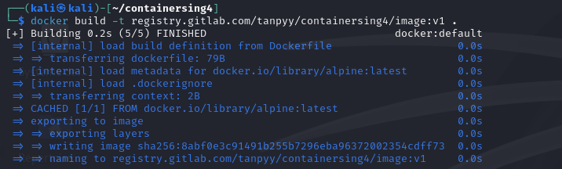
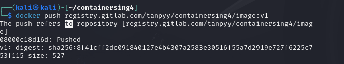
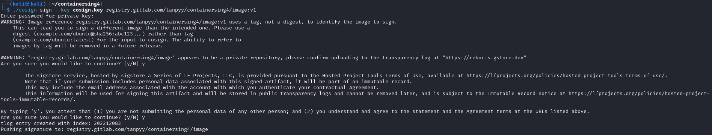
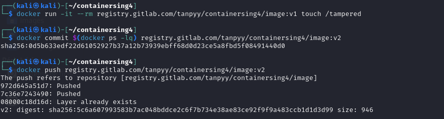
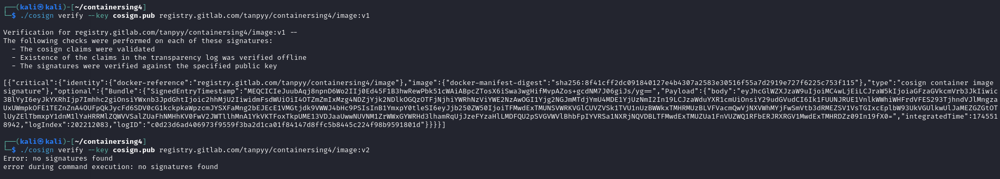
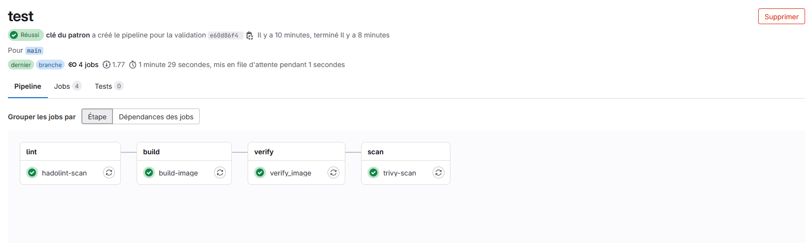
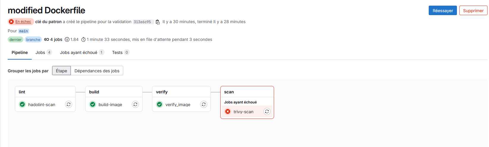
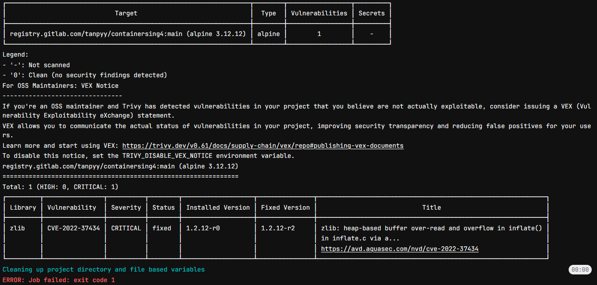

# Sécurité dans la CI/CD
## Partie 1
### 1. Générer une paire de clés
On installe Cosign et génère une paire de clé
```bash
curl -sSfL https://github.com/sigstore/cosign/releases/latest/download/cosign-linux-amd64 -o cosign && chmod +x cosign

./cosign generate-key-pair
```

### 2. Signer une image Docker et la pousser vers GitLab
On commence par créer un Fichiers Dockerfile simple 
```bash
echo -e 'FROM alpine\nCMD ["echo", "Hello, World!"]' > Dockerfile
```
Puis on build l'image



On se connecte dans le registre gitlab puis on push l'image



Et on signe avec Cosign et la clé GPG


### 3. Modifier l'image et pousser une version modifiée 
On modifie l'image et on l'a push


### 4. Vérifier la signature avant/après modification 
On vérifie la signature


### 5. Quelles sont les résultats de ces 2 commandes ?
La commande 1 réussit, l'image est bien signée, intacte et authentique tandis que la deuxième echoue, la signature ne correspond plus, ce qui montre que l'image a été altérée.

## Partie 2
On crée le ``Dockerfile`` et le ``.gitlab-ci.yml``, on commit, on push et on observe la pipeline.

- Lint : Analyse le Dockerfile pour détecter les mauvaises pratiques.
- Build : Construit l’image Docker et la pousse sur le registre GitLab.
- Vérification : Vérifie la signature de l’image à l’aide de Cosign et d’un certificat issu de GitLab.
- Scan (Trivy) : Scanne l’image pour détecter les vulnérabilités critiques et hautes.

Puis on simule une vulnérabilité et on refait un push.



Cette fois, il y a une erreur dans la pipeline. 

Le Dockerfile a été modifié pour utiliser une version plus ancienne d’Alpine (3.12) et de curl (7.79.1-r1), qui contient des vulnérabilités critiques connues.



Trivy détecte ces failles et stoppe la pipeline avec un exit-code 1 car on lui a demandé de s’arrêter en cas de vulnérabilités de type HIGH ou CRITICAL.